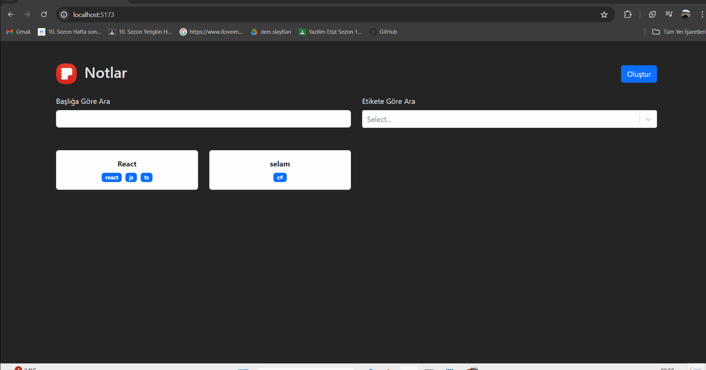

# Note App Project

Bu proje, React, Vite ve TypeScript kullanılarak oluşturulmuş bir not uygulamasıdır. Uygulama, not oluşturma, silme, düzenleme, etiket ekleme ve başlık ve etikete göre filtreleme gibi özellikler sunar. Başlık filtrelemesinde debounce uygulanarak performans artışı sağlanmıştır. Ayrıca, markdown yazı stili kullanılarak not oluşturma imkanı sağlar.

## Özellikler

- Not oluşturma
- Not silme
- Not düzenleme
- Etiket ekleme
- Başlık ve etikete göre filtreleme
- Başlık filtrelemesinde debounce ile performans artışı
- Markdown yazı stili ile not oluşturma

## Kullanılan Teknolojiler ve Kütüphaneler

- **React**: ^18.3.1
- **TypeScript**
- **@uidotdev/usehooks**: ^2.4.1
- **Bootstrap**: ^5.3.3
- **React Bootstrap**: ^2.10.4
- **React DOM**: ^18.3.1
- **React Markdown**: ^9.0.1
- **React Router DOM**: ^6.25.1
- **React Select**: ^5.8.0
- **UUID**: ^10.0.0

## Canlı proje adresi:

https://notes-app-type-script-beige.vercel.app/

## Proje Gifi

